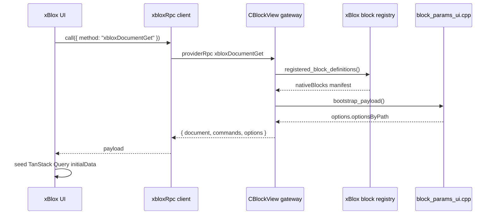
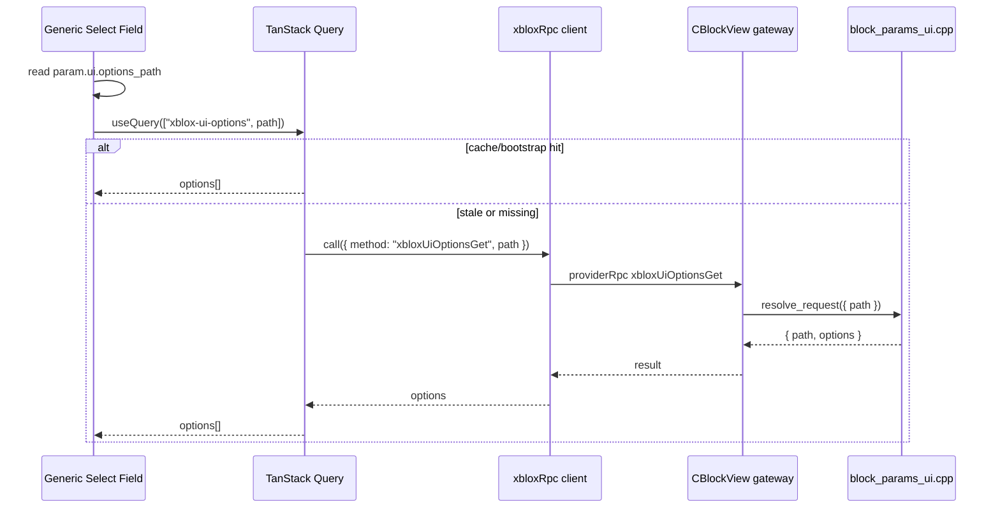
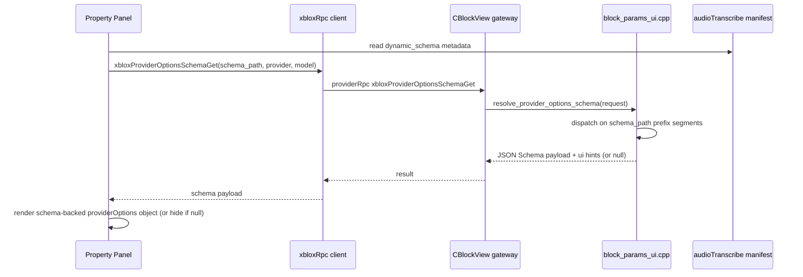
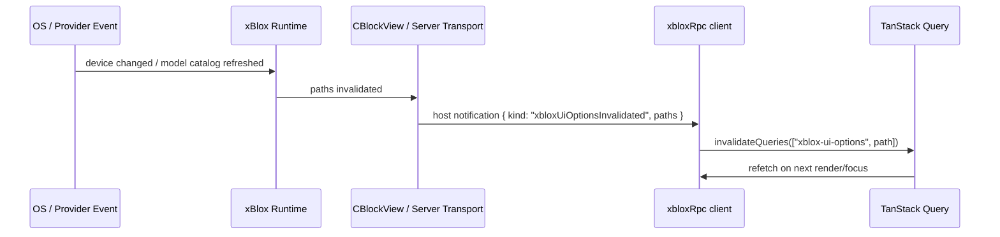

# xBlox UI Schema Tracking

## Context

`audioTranscribe` can now use the local `whisper` STT provider, but the xBlox
block UI only exposes the shared `provider` / `model` pair. Whisper-specific
runtime options such as backend, GPU device, threads, language, and flash
attention are currently baked into the C++ implementation or available through
the CLI only. The same problem will recur for other model-specific parameters:
Replicate OpenAPI inputs, VibeVoice runtime fields, image/video model knobs, and
future local backend options.

This document tracks a general schema mechanism for native xBlox blocks. The UI
property panel is only one sink. The same metadata should also feed CLI help,
`xblox info` / inspection JSON, and a future REST API.

## Current State

### Implemented: Full dynamic schema pipeline

| Layer | File | Status |
|-------|------|--------|
| Param metadata | `block_params.hpp` — `.dyn()`, `.ui()` | ✓ |
| Manifest serialization | `block_registry.hpp` — `to_manifest()` | ✓ |
| UI resolver | `block_params_ui.cpp` / `.hpp` | ✓ |
| RPC gateway | `CBlockView.cpp` — `xbloxProviderOptionsSchemaGet`, `xbloxUiOptionsGet` | ✓ |
| RPC client | `apps/xblox/src/xblox/rpc/client.ts` — `xbloxRpc.call(...)` | ✓ |
| Schema renderer | `xblox-property-panel.tsx` — `DynamicProviderOptionsGroup` | ✓ |
| TanStack caching — select options | `xbloxQueryKeys.uiOptions(path)` — 30 s stale | ✓ |
| TanStack caching — provider schema | `xbloxQueryKeys.providerSchema(...)` — 5 min stale | ✓ |
| Bootstrap options | `xbloxDocumentGet.options.optionsByPath` | ✓ |
| Dynamic model list (`options_list`) | `dyn.kind=options_list` + `options_path_template` | ✓ |
| Provider-context mid-slot | `ProviderModelPicker.midSlot` | ✓ |
| Replicate collections + models | `block_params_ui.cpp` — `providers.replicate.*` | ✓ |
| Replicate model schema (hop 2) | `replicate_provider_options_schema` via OpenAPI cache | ✓ |
| CLI smoke testing | `xblox info options --path`, `xblox info schema` | ✓ |

### Implemented: Whisper STT

`audioTranscribe` + `provider=whisper`:

```cpp
pd_json("providerOptions").adv().grp("speech_model")
    .dyn({ "kind":"provider_options", "schema_path":"providers.whisper",
           "provider_field":"provider", "model_field":"model",
           "schema_method":"xbloxProviderOptionsSchemaGet",
           "value_field":"providerOptions" })
```

| Field | Type | Default | Condition |
|-------|------|---------|-----------|
| `backend` | enum `cpu\|gpu` | `cpu` | — |
| `gpuDevice` | integer ≥ 0 | `0` | `backend == gpu` |
| `threads` | integer ≥ 0 | `0` | — |
| `language` | string | `auto` | — |
| `flashAttn` | enum `auto\|on\|off` | `auto` | — |

### Implemented: Replicate two-hop dynamic UI (imageCreate / imageTransform)

This is the first "nested dynamic" case: **provider → collection → model → params**.
See [Pattern: Nested Dynamic Selection](#pattern-nested-dynamic-selection) below
for a reusable recipe.

```cpp
// image_blocks.cpp — ai_image_params()

// Hop 0: provider (static select via ProviderModelPicker)

// Hop 1a: collection — options_path select, rendered as midSlot
pd_str("replicateCollection").grp("model").lbl("Collection").dflt("official")
    .ui({ "control":"select",
          "options_path":"providers.replicate.collections",
          "empty_label":"official" })

// Hop 1b: model — typeahead, options driven by collection field
pd_model().grp("model")
    .dyn({ "kind":"options_list",
           "options_path_template":"providers.replicate.models.{replicateCollection}",
           "provider_match":"replicate",
           "provider_field":"provider",
           "options_method":"xbloxUiOptionsGet" })

// Hop 2: model-specific params
pd_json("providerOptions").adv().grp("model").lbl("Model options")
    .dyn({ "kind":"provider_options",
           "schema_path":"providers.replicate",
           "provider_field":"provider", "model_field":"model",
           "schema_method":"xbloxProviderOptionsSchemaGet",
           "value_field":"providerOptions" })
```

`block_params_ui.cpp` handles both hops:
- `resolve_options_path("providers.replicate.collections")` → `replicate_collections_options()`
- `resolve_options_path("providers.replicate.models.{slug}")` → `replicate_models_options(slug)`
- `resolve_provider_options_schema(path="providers.replicate", model)` → `replicate_provider_options_schema(model, sub_kind)`

C++ handler merges `io.json("providerOptions")` into the Replicate API call
(`call_replicate_core` / `apply_transform_options_from_json`).

### Implemented: Generic select options (`options_path`)

Audio device params, OCR model selects, and vision model selects:

```json
{ "ui": { "control": "select", "options_path": "audio.devices.input", "empty_label": "..." } }
```

Paths registered in `resolve_options_path`:
`audio.devices.input`, `audio.devices.output`, `ocr.models.onnx`,
`ocr.models.vlm`, `vision.models.vlm`,
`providers.replicate.collections`, `providers.replicate.models.{slug}`.

### Implemented: C++ UI resolver split

- `block_params.hpp` — static param metadata, `ui`, `dynamic_schema`
- `block_params_ui.cpp` — all provider-specific schema payloads, select lists
- `CBlockView.cpp` — transport gateway only; no schema logic

### Implemented: Generic UI mechanisms (no provider knowledge in web app)

- `ProviderModelPicker.midSlot` — any param with `ui.control=select` and
  `group=model` is automatically rendered between provider and model dropdowns.
  Driven by C++ param declarations.
- `dyn.kind=options_list` + `options_path_template` — model field typeahead
  backed by dynamic options list. `{field}` tokens substituted from block record.
  Only activates when `provider_match` matches. Panel has no provider names.
- `DynamicProviderOptionsGroup` title hardcoded `"Model Options"` — not read
  from param label. If per-provider titles are needed, add `title` to the wire
  format payload in `block_params_ui.cpp`.

### Reference: Chat Replicate schema pattern (do not reuse)

Chat quick settings have a mature router→model→params pattern for Replicate.
xBlox **duplicates**, not reuses, the C++ OpenAPI resolver and produces its own
`schema + ui` wire format. The chat Zustand store coupling (`pmChatStore`,
`openApiSchema.ts`) is chat-local and must not leak into xBlox.

## Pattern: Nested Dynamic Selection

This section documents the recipe for any block that needs a
**provider → sub-selector → model → model-specific params** flow.
Replicate (`imageCreate` / `imageTransform`) is the reference implementation.

### Overview

Three kinds of dynamism, each declared entirely in C++ `.dyn()` / `.ui()` metadata.
The web app contains zero provider names.

```
provider (static select)
  └─ replicateCollection  (hop 1a — options_path select, midSlot)
       └─ model           (hop 1b — options_list typeahead, template path)
            └─ providerOptions (hop 2 — provider_options schema)
```

### Step 1 — Sub-selector (hop 1a)

Declare a `pd_str` param in group `"model"` with `ui.control=select` and a
static `options_path`:

```cpp
pd_str("replicateCollection").grp("model").lbl("Collection").dflt("official")
    .ui({ "control":      "select",
          "options_path": "providers.replicate.collections",
          "empty_label":  "official" })
```

**UI effect:** The property panel detects any `group=model` param with
`ui.control=select` and renders it as `midSlot` inside `ProviderModelPicker`
(between the provider dropdown and the model typeahead). No panel code change
needed for new providers.

**Backend:** Register the path in `resolve_options_path`:

```cpp
if (path == "providers.replicate.collections")
    return replicate_collections_options();
```

Returns `[{ "value": "flux", "label": "FLUX family of models" }, ...]`.

### Step 2 — Dynamic model list (hop 1b)

Annotate the `pd_model()` param with `dyn.kind=options_list` and a path
template. Use `{field}` tokens that reference other block fields:

```cpp
pd_model().grp("model")
    .dyn({ "kind":                  "options_list",
           "options_path_template": "providers.replicate.models.{replicateCollection}",
           "provider_match":        "replicate",
           "provider_field":        "provider",
           "options_method":        "xbloxUiOptionsGet" })
```

**UI effect:** Panel reads `dyn.provider_match`. When `record.provider ===
"replicate"`, it substitutes `{replicateCollection}` → `record.replicateCollection`,
calls `xbloxUiOptionsGet` with the computed path, and feeds the result into
`ProviderModelPicker` as `dynamicModelOptions`. For other providers, model
typeahead falls back to the static list from `options.ts`.

**Backend:** Register the path pattern in `resolve_options_path`:

```cpp
if (path.rfind("providers.replicate.models.", 0) == 0) {
    auto slug = path.substr(std::string("providers.replicate.models.").size());
    return replicate_models_options(slug);
}
```

Returns `[{ "value": "black-forest-labs/flux-1.1-pro", "label": "..." }, ...]`.

### Step 3 — Model-specific params (hop 2)

Declare a `pd_json("providerOptions")` param with `dyn.kind=provider_options`:

```cpp
pd_json("providerOptions").adv().grp("model").lbl("Model options")
    .dyn({ "kind":          "provider_options",
           "schema_path":   "providers.replicate",
           "provider_field":"provider",
           "model_field":   "model",
           "schema_method": "xbloxProviderOptionsSchemaGet",
           "value_field":   "providerOptions" })
```

**UI effect:** When `provider` and `model` are non-empty, panel calls
`xbloxProviderOptionsSchemaGet` (cached 5 min via TanStack Query keyed on
`[method, provider, model, blockKind]`). Result rendered by
`DynamicProviderOptionsGroup` as "Model Options" PropGroup.

**Backend:** Register in `resolve_provider_options_schema`:

```cpp
if (path.rfind("providers.replicate", 0) == 0)
    return replicate_provider_options_schema(model, sub_kind);
```

`replicate_provider_options_schema` calls `lookup_replicate_openapi_input_flat`,
filters tooling keys, and formats the `schema + ui` wire payload.

### Step 4 — Block handler

Read and apply `providerOptions` in the C++ block handler:

```cpp
// image_blocks.cpp — transform_options_from_io
const nlohmann::json& po = io.json("providerOptions");
if (po.is_object() && !po.empty())
    opts.provider_options = po;

// transform.cpp — call_replicate_core
for (auto& [k, v] : opts.provider_options.items())
    input[k] = v;   // merged into Replicate API input object
```

### Step 5 — Default block data

Add the new field(s) to the block's default JSON record so the UI starts in
a known state:

```cpp
registry["imageTransform"] = bdb(...,
    { ..., {"replicateCollection","official"}, ... })
```

### Step 6 — Smoke-test via CLI

```powershell
# Verify hop 1a — collections
tanit-cli xblox info options --path "providers.replicate.collections"

# Verify hop 1b — models for a collection
tanit-cli xblox info options --path "providers.replicate.models.flux"

# Verify hop 2 — model-specific schema
tanit-cli xblox info schema --schema-path "providers.replicate" --model "black-forest-labs/flux-1.1-pro"
```

### Checklist for a new nested-dynamic block

- [ ] Hop 1a: `pd_str("{subField}").grp("model").ui({control,options_path})` — register path in `resolve_options_path`
- [ ] Hop 1b: `pd_model().dyn({kind:options_list, options_path_template, provider_match})` — register path pattern in `resolve_options_path`
- [ ] Hop 2: `pd_json("providerOptions").dyn({kind:provider_options, schema_path})` — register `schema_path` in `resolve_provider_options_schema`
- [ ] Handler: read `io.json("providerOptions")` and merge into API call
- [ ] Default data: add `{subField}` to block default JSON record
- [ ] Smoke-test all three CLI paths

---

## Pattern: Kind Mapping for Dynamic Schema Fields (`x-xblox.kind`) — implemented (UI overlay)

Dynamic provider schemas (Replicate OpenAPI etc.) arrive as raw JSON Schema:
`string`, `integer`, `number`, `boolean`. But many fields are *semantically*
known xBlox param kinds — a Replicate `mask` input (`string`, `format: uri`)
is really an `image_path` and should get the file picker, exactly like a
native `pd_image()` param.

Goal: map dynamic schema properties to existing `ParamKind`s so the renderer
reuses the native widgets — file picker, prompt textarea, color input —
without the web app learning anything about providers.

### Where the mapping lives

In C++ — `block_params_mapping.cpp` (separate from `block_params_ui.cpp`),
gated by a local `constexpr bool MAP_MODEL_PARAMS = true`. Applied as a
post-processing pass (`annotate_schema_param_kinds`) in
`replicate_provider_options_schema` before the schema is returned. The
annotation is carried in the reserved `x-xblox` namespace of the wire format:

```json
{
  "mask": {
    "type": "string",
    "format": "uri",
    "description": "Mask image for inpainting",
    "x-xblox": { "kind": "image_path" }
  }
}
```

The renderer honors `x-xblox.kind` generically (same kind→widget mapping the
native params already use via `isPathKind`). No provider names in the panel.

### Tiered matcher — cheap first

Tier 0 and 1 are table-driven and nearly free. Tier 2 is optional and only
runs when the cheap tiers fail.

**Tier 0 — structural (JSON Schema facts):**

| Schema fact | Result |
|---|---|
| `enum` present | no kind — renderer already shows a select |
| `type != string` | no kind — numeric/boolean widgets already correct |
| `format == "uri"` | path family — continue to tier 1 to pick which |

**Tier 1 — name glob patterns (the cheap part):**

```cpp
// block_params_ui.cpp — first match wins
struct KindRule { const char* name_glob; const char* requires_format; const char* kind; };
static const KindRule k_schema_kind_rules[] = {
    // format:uri family — which media kind?
    {"*image*", "uri", "image_path"},
    {"*mask*",  "uri", "image_path"},
    {"*img*",   "uri", "image_path"},
    {"*audio*", "uri", "audio_path"},
    {"*voice*", "uri", "audio_path"},
    {"*speech*","uri", "audio_path"},
    {"*video*", "uri", "video_path"},
    {"*",       "uri", "file_path"},     // any other uri → generic file
    // plain string fields with strong name signals
    {"*prompt*",   nullptr, "prompt"},   // textarea instead of single line
    {"*color*",    nullptr, "color"},
    {"*negative*", nullptr, "prompt"},   // negative_prompt etc.
};
```

Glob match is `media::strutil`-level (or a 10-line `*`-wildcard matcher).
Property name is lowercased before matching.

**Tier 2 — semantic fallback (optional, embed-guarded):**

When tiers 0–1 produce no kind and the field is a `string`, the existing
`EmbedInference` backend can score the property's `name + title + description`
against kind prototype phrases:

```cpp
#if FEATURE_COMMAND_LLAMA_INFERENCE
if (kind.empty() && media::strutil::has_embed_backend()) {
    // prototypes: { "input image file", "audio recording", "video clip",
    //               "text prompt instruction", "css color value" }
    // pick argmax if score >= 0.55, else leave unmapped
}
#endif
```

This is the same lazy pattern `InfoTool.cpp` already uses for tool discovery
(substring first, `embed_match_score` only when the cheap check fails). Cost
is one embed per unmapped string field, cached by `EmbedInference`'s string
cache. Strictly optional: without a loaded embed model, tier 2 is skipped and
behavior is identical to tiers 0–1 alone.

### Renderer contract

`DynamicProviderOptionsGroup` gains a kind check before the fallback text
field:

| `x-xblox.kind` | Widget |
|---|---|
| `image_path` / `audio_path` / `video_path` / `file_path` | text input + `…` file picker (`xbloxPickPath`) |
| `prompt` | `VariableTextField` textarea |
| `color` | color input |
| (absent) | current behavior unchanged |

### Runtime contract — local path → provider value

Picking a local file produces `C:\...\photo.png`, but Replicate URI inputs
expect an `https://` URL or a `data:` URI. The handler merge in
`call_replicate_core` must convert: when a `providerOptions` value belongs to
a uri-kind field and resolves to an existing local file, encode it with the
existing `to_data_url` helper (already used for the built-in `image_input`).
Values that are already `http(s)://` or `data:` pass through untouched.

This means the schema's kind annotations must also be available at execution
time, not only in the UI — either by re-resolving the schema in the handler
(cached) or by a cheap re-application of the same tier-0/1 rules to the
outgoing values.

### Sinks

The same `x-xblox.kind` annotation feeds CLI help (`xblox info schema`),
REST, and docs generation — "this Replicate field takes an image file" is
useful everywhere, not just in the property panel.

---

## Design

The core design is implemented: a generic dynamic schema layer on top of native
block params.

1. Base block manifest is static and stable.
2. Specific params declare `dynamic_schema` metadata that controls an option schema.
3. Schema is fetched (via RPC) when controlling values (`provider`, `model`) change.
4. Schema is rendered by `DynamicProviderOptionsGroup` using existing control types.
5. Dynamic values are stored in the block JSON under a single object field (`providerOptions`).
6. The C++ handler reads that object and maps it to provider-specific options.

`audioTranscribe` with Whisper options looks like:

```json
{
  "kind": "audioTranscribe",
  "provider": "whisper",
  "model": "base.en",
  "providerOptions": {
    "backend": "cpu",
    "gpuDevice": 0,
    "threads": 0,
    "language": "auto",
    "flashAttn": "auto"
  }
}
```

The specific object name is open. `providerOptions` is a good default because it
generalizes to Replicate, VibeVoice, OpenAI, local backends, and future providers.

## Schema Sinks

The same schema metadata should serve several consumers. If each sink invents
its own representation, the help text, UI, and API will drift.

### xBlox Property UI

The property panel needs the schema to render conditional controls and persist
values into the block document. This is the most visible sink, but it should not
own the contract.

### CLI Help

We do not currently have block-specific CLI help beyond broad `xblox info` /
command help behavior. A schema contract would make commands like these possible:

```powershell
tanit-cli xblox info block audioTranscribe
tanit-cli xblox info block audioTranscribe --provider whisper
tanit-cli xblox info block audioTranscribe --provider whisper --json
```

Human help should be generated from the same static params plus dynamic
provider/model option schema:

```text
audioTranscribe
  provider: whisper
  model: base.en

Base params:
  --maxDurationMs <ms>     Maximum recording duration.
  --silenceMs <ms>         Stop after silence.
  --device <name>          Microphone.

Provider options (provider=whisper):
  backend      cpu|gpu     default: cpu
  gpuDevice    integer     default: 0, only when backend=gpu
  threads      integer     default: 0
  language     string      default: auto
  flashAttn    auto|on|off default: auto
```

JSON help should expose the raw schema rather than a lossy text rendering:

```json
{
  "block": "audioTranscribe",
  "params": [],
  "dynamic_schemas": [
    {
      "when": { "provider": "whisper" },
      "value_field": "providerOptions",
      "schema": { "type": "object", "properties": {} },
      "ui": {}
    }
  ]
}
```

CLI should be a read-only sink for this metadata at first. It does not need to
run schema validation independently if the xBlox resolver/handler already does,
but it should display enough information for users and scripts to construct
valid block JSON.

### Block Inspection JSON

`xblox info --json` already emits native block manifests. Dynamic schemas should
extend that manifest shape or be available through a deterministic companion
query. Two possible approaches:

- Inline static dynamic schemas that are known at compile time.
- Expose `schema_refs` in the manifest, then resolve them with an inspect/query
  command or host RPC.

For provider/model-dependent schemas, avoid bloating the base manifest with every
possible provider. The base manifest can say "this block has a dynamic
`providerOptions` schema keyed by provider/model"; the inspect command can fetch
the concrete schema for `provider=whisper`.

### Future REST API

A future REST API should expose the same inspection contract. Suggested routes:

```text
GET /v1/xblox/blocks
GET /v1/xblox/blocks/audioTranscribe
GET /v1/xblox/blocks/audioTranscribe/options-schema?provider=whisper&model=base.en
```

The REST response should match the CLI `--json` shape. That makes it possible
for external tools, docs generators, SDKs, and UI clients to share one schema
consumer.

### Documentation Generation

Docs can also be generated from the same metadata:

- Static block parameter reference from `params`.
- Provider/model option reference from dynamic schemas.
- Examples built from defaults.

This suggests the schema should include enough text metadata (`title`,
`description`, defaults, enum labels if needed) to make generated docs useful.

## Candidate Manifest Extension

Extend `ParamDef::to_json()` and `BlockManifestParam` with optional dynamic
schema metadata. Keep it advisory so old sinks ignore it safely.

Possible shape:

```json
{
  "name": "providerOptions",
  "kind": "json_value",
  "group": "speech_model",
  "label": "Provider options",
  "dynamic_schema": {
    "kind": "provider_options",
    "schema_path": "providers.whisper",
    "provider_field": "provider",
    "model_field": "model",
    "schema_method": "xbloxProviderOptionsSchemaGet",
    "value_field": "providerOptions"
  }
}
```

`schema_path` is the resolver routing key — dot-separated segments, same
convention as `options_path`. The resolver in `block_params_ui.cpp` matches on
the longest known prefix. Unknown paths return `null` schema silently.

Alternative for fully static options:

```json
{
  "name": "providerOptions",
  "kind": "json_value",
  "dynamic_schema": {
    "kind": "conditional",
    "when": { "provider": "whisper" },
    "properties": {
      "backend": { "type": "string", "enum": ["cpu", "gpu"], "default": "cpu" },
      "gpuDevice": { "type": "integer", "minimum": 0, "default": 0 },
      "threads": { "type": "integer", "minimum": 0, "default": 0 },
      "language": { "type": "string", "default": "auto" },
      "flashAttn": { "type": "string", "enum": ["auto", "on", "off"], "default": "auto" }
    }
  }
}
```

The dynamic RPC path is better long term because Replicate/OpenAPI schemas and
provider model catalogs are not fixed at compile time.

## Wire Format

The `xbloxProviderOptionsSchemaGet` RPC response shape (live, used by Whisper):

```json
{
  "schema_version": 1,
  "value_field": "providerOptions",
  "schema": {
    "type": "object",
    "properties": {
      "backend": { "type": "string", "enum": ["cpu", "gpu"], "default": "cpu" }
    }
  },
  "ui": {
    "order": ["backend", "gpuDevice", "threads", "language", "flashAttn"],
    "fields": {
      "gpuDevice": { "visible_when": { "backend": "gpu" } }
    }
  }
}
```

Supported property types: `string`, `integer`, `number`, `boolean`.  
Supported `ui.fields[key]` keys: `visible_when` (simple equality map).  
Not supported yet: nested objects, arrays, `$ref`, `if/then/else`.

`x-xblox` namespace keys for per-property hints (`widget`, `group`, `advanced`,
`enabled_when`, `coerce`) are reserved but not rendered yet. `x-xblox.kind` is
implemented as a UI overlay (see Pattern: Kind Mapping above) — annotated in
`block_params_mapping.cpp`, rendered by `DynamicProviderOptionsGroup`.

## Whisper STT (implemented)

`audioTranscribe` + `provider=whisper` is fully wired:

- `backend`: enum `cpu|gpu`, default `cpu`.
- `gpuDevice`: integer, default `0`, visible only when `backend == gpu`.
- `threads`: integer, default `0` (auto).
- `language`: string, default `auto`.
- `flashAttn`: enum `auto|on|off`, default `auto`.

Values flow through `providerOptions` → `whisper_options_from_json()` →
`whisper_local_transcribe_with_options()`.

`audioTranscribe` also now accepts an `input` audio file path (added in C++
`audio_blocks.cpp`). When `input` is non-empty, mic recording is bypassed and
`maxDurationMs` / `silenceMs` / `device` are ignored.

## Handler Contract (live)

In `audioTranscribe`:

```cpp
auto input_file = io.str("input");  // audio file path, empty = use mic
auto provider   = io.str("provider");
auto opts_json  = io.json("providerOptions");  // already resolved
```

For non-handled providers, unknown `providerOptions` objects are ignored, keeping
blocks portable across provider changes.

## UI Rendering Contract (live)

`DynamicProviderOptionsGroup` in `xblox-property-panel.tsx` renders:

- `boolean` → checkbox
- `string` enum → select
- `string` → text field
- `integer`/`number` → numeric input with min/max/step
- Conditional visibility via `ui.fields[key].visible_when`
- Defaults from schema `properties[key].default`
- Values persisted to `block[value_field]` (`providerOptions`)

Not yet supported in the renderer:
- Value preservation on provider/model change (stale values stay in block JSON)
- String→scalar coercion before execution

Schema fetching uses TanStack Query (`xbloxQueryKeys.providerSchema`, 5 min
stale, `retry: false`). Multiple rapid re-renders share a single in-flight
request; same provider+model combination reuses cached schema.

Reference for future improvements: `openApiSchema.ts` (`buildReplicateOpenApiFieldValues`,
`coerceOpenApiFieldValuesForHost`, `videoOpenApiFieldVisible`).

## Host/RPC Contract

The current native transport is `CBlockView`, but it should stay a gateway. The
schema/option semantics live in the xBlox UI resolver layer:

- `block_params.hpp`: declares static param metadata (`ui`, `dynamic_schema`,
  kind, defaults, constraints).
- `block_params_ui.cpp`: resolves UI/inspection data such as select option
  lists and provider-specific schema payloads.
- `CBlockView.cpp`: forwards RPC requests and owns only view-specific actions
  such as file/window pickers and HWND-owned execution.
- `apps/xblox/src/xblox/rpc/client.ts`: central xBlox RPC client. The current
  transport is native WebView provider RPC; future REST/Hono or WebSocket
  transports should sit behind the same interface.

This split keeps pure xBlox CLI/server runtime free to compile without UI
inspection code when it does not need it.

### Generic Option Paths

Static params can declare generic UI controls:

```json
{
  "name": "device",
  "kind": "device_name",
  "ui": {
    "control": "select",
    "options_path": "audio.devices.input",
    "empty_label": "(system default microphone)"
  }
}
```

The property panel does not know how to enumerate microphones. It only renders a
select and asks the xBlox UI resolver for `options_path`.

Bootstrap payload:

```json
{
  "options": {
    "optionsByPath": {
      "audio.devices.input": [{ "value": "Microphone", "label": "Microphone" }],
      "audio.devices.output": [{ "value": "Speakers", "label": "Speakers" }]
    }
  }
}
```

On demand request:

```json
{
  "kind": "providerRpc",
  "method": "xbloxUiOptionsGet",
  "path": "audio.devices.input"
}
```

Response:

```json
{
  "path": "audio.devices.input",
  "options": [{ "value": "Microphone", "label": "Microphone (default)" }]
}
```

The web app caches this through TanStack Query using:

```ts
["xblox-ui-options", path]
```

### Provider Option Schemas

The RPC request carries `schema_path` — a dot-separated segment path, same
convention as `options_path` for static selects. The resolver in
`block_params_ui.cpp` dispatches on path segments. `blockKind` is not a routing
key; any block that declares the right `schema_path` gets the schema.

```json
{
  "kind": "providerRpc",
  "method": "xbloxProviderOptionsSchemaGet",
  "schema_path": "providers.whisper",
  "provider": "whisper",
  "model": "base.en"
}
```

The resolver matches the longest known prefix:

```
providers.whisper          → whisper_provider_options_schema(model)
providers.replicate        → replicate_provider_options_schema(model)
providers.huggingface      → huggingface_provider_options_schema(model)
<unknown path>             → null schema (no error, UI group hidden)
```

No `blockKind` in the dispatch table. A new block wanting Replicate params
just declares `schema_path: "providers.replicate"` in its `.dyn()` metadata —
zero changes to `block_params_ui.cpp` for the new block.

Sub-segments are available for type-specific filtering:

```
providers.replicate.image  → Replicate image schema (hides video-only fields)
providers.replicate.video  → Replicate video schema (hides image-only fields)
```

Response shape:

```json
{
  "schema_version": 1,
  "value_field": "providerOptions",
  "schema": {
    "type": "object",
    "properties": {
      "backend": { "type": "string", "enum": ["cpu", "gpu"], "default": "cpu" }
    }
  },
  "ui": {
    "order": ["backend"],
    "fields": {
      "gpuDevice": { "visible_when": { "backend": "gpu" } }
    }
  }
}
```

`schema: null` is a valid response — means "no options for this
provider/model". The UI hides the provider options group silently.

The same payload serves `CBlockView` RPC, CLI `--json`, and future REST.
Transport varies; schema shape does not.

## Sequence Flows

### Document Bootstrap



The property panel should prefer bootstrap data. It should not synchronously
enumerate field data while rendering a selected block.

### Select Options



### Provider Options Schema



`block_params_ui.cpp` currently handles `providers.whisper`. Replicate and
HuggingFace are the next paths to register.

### Future Invalidation



Initial implementation can use stale times and manual refresh. Push invalidation
is the path for device unplug/replug, model downloads, provider catalog refresh,
and future server-side changes.

## Open Questions

- Should stale provider-specific values be kept when provider changes away and
  back, or cleared immediately?
- Should invalid fields block execution through the xBlox resolver, or remain UI
  warnings until the handler validates them?
- Should schema fetching be allowed during `xblox info --json`, be exposed only
  through specific inspect commands, or both?
- Should REST expose only static manifests without credentials, or also dynamic
  provider/model schemas that may require provider catalog access?
- For Replicate image blocks: should existing static params (`aspectRatio`,
  `imageSize`) be migrated into `providerOptions`, or kept as block-level params
  with schema duplication suppressed?

## TODO

### Done

1. Extend TS manifest types with optional `dynamic_schema` / `BlockParamUi` metadata.
2. Add C++ `ParamDef::ui()` / `.dyn()` metadata for frontend/sink hints.
3. `providerOptions` JSON param + `audioTranscribe` Whisper wiring.
4. `block_params_ui.cpp/.hpp` — xBlox UI/inspection resolver split.
5. Generic `ui.control=select` + `options_path` for all select controls.
6. Bootstrap `options.optionsByPath` through `xbloxDocumentGet`.
7. TanStack Query caching for select options (`xbloxQueryKeys.uiOptions`).
8. TanStack Query caching for provider schema (`xbloxQueryKeys.providerSchema`, 5 min).
9. `DynamicProviderOptionsGroup` renderer with `visible_when` support.
10. `ProviderModelPicker` composite widget (STT / TTS / router / image / vision).
11. Replicate: `providers.replicate.collections` + `providers.replicate.models.{slug}` in `resolve_options_path`.
12. Replicate: `replicate_provider_options_schema` in `resolve_provider_options_schema`.
13. `dyn.kind=options_list` — dynamic model typeahead backed by `options_path_template`.
14. `ProviderModelPicker.midSlot` — sub-selector between provider and model.
15. `ProviderModelPicker.dynamicModelOptions` — generic dynamic model list override.
16. CLI `xblox info options --path` and `xblox info schema` smoke-test subcommands.
17. Nested dynamic UI pattern documented (see above).

### Next

#### Whisper: migrate to schema_path routing

`resolve_provider_options_schema` still branches on `blockKind + provider` for
Whisper. Simplify: add `schema_path: "providers.whisper"` to the `.dyn()` call
in `audio_blocks.cpp` and route on `schema_path` in the resolver.

#### HuggingFace model params

HuggingFace appears only as an LLM router today. Before implementing:
1. Identify schema source (HF Inference API vs. static catalog).
2. Decide which blocks expose HF.
3. Register `schema_path: "providers.huggingface"` — follow the checklist above.

#### Kind mapping for dynamic schema fields (`x-xblox.kind`)

UI overlay implemented (`block_params_mapping.cpp` + renderer widgets +
optional embed tier). Remaining:

1. Runtime: local path → `data:` URI conversion in `call_replicate_core`
   merge for uri-kind fields. Until then, picked local paths are sent to
   Replicate verbatim — users must paste URLs for uri inputs or the
   prediction fails. Tiers 0/1 rules only (deterministic), per the design.

#### Renderer hardening

1. Value preservation when model changes within same provider.
2. Stale field quarantine / explicit clear when provider changes.
3. `DynamicProviderOptionsGroup` title from wire payload `title` field
   (set in `block_params_ui.cpp`) rather than hardcoded constant.

#### CLI / REST inspection

1. CLI `xblox info block <kind> --provider <p> --model <m> --json` using
   `block_params_ui.cpp` resolver payloads.
2. REST `GET /v1/xblox/blocks/{kind}/options-schema?provider=…&model=…`
   matching the same response shape.
3. Invalidation notifications for option paths (device unplug, model download).

## Design Principles

- `block_params_ui.cpp` is the single extension point for all provider-specific
  dynamic schemas. `CBlockView` stays a gateway.
- All UI specifics (field visibility, order, groups) are declared in C++ — the
  web app and runtime have no provider-specific knowledge.
- Dynamic schema payload (`schema` + `ui`) is the shared contract for property
  panel, CLI help, `xblox info --json`, and future REST. Transport varies;
  schema shape does not.
- `providerOptions` is the canonical storage field for dynamic param values in
  block JSON. Providers that need separate option namespaces should use a
  `value_field` override in the schema metadata.
- Resolver routing is by `schema_path` segment, not by `blockKind`. Any block
  declaring `schema_path: "providers.replicate"` gets the Replicate schema
  without any changes to `block_params_ui.cpp`. Adding a new block does not
  require a new branch in the resolver.
- Resolver dispatch is lazy and optional: unknown `schema_path` values return
  `null` schema silently. The UI hides the provider options group; no error.
- Provider-specific implementations in `block_params_ui.cpp` are independent of
  the chat provider layer (`ChatWebPanel_Provider.cpp`). Code may be duplicated
  at first rather than shared, to avoid coupling the xBlox UI resolver to chat
  infrastructure.
