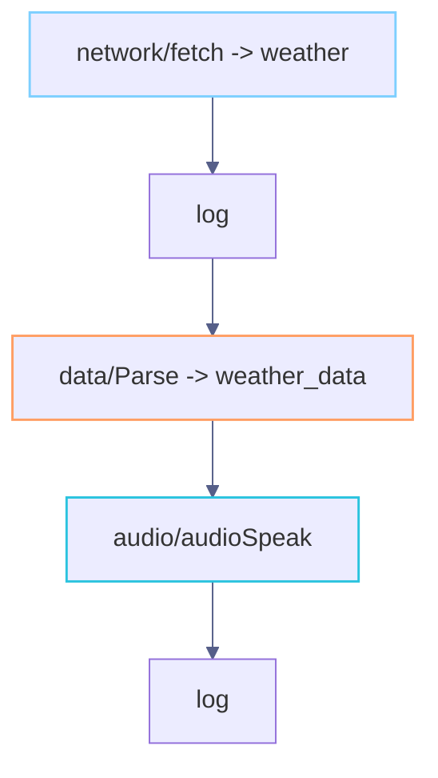

# weather_barcelona.xblox

## Context

- stdout: `"hello\n"`
- weather: `"{\"latitude\":41.375,\"longitude\":2.125,\"generationtime_ms\":...`
- weather_data: `25.6`

## Script

```mermaid
graph TD
  B0["network/fetch -> weather"]
  B1["log"]
  B0 --> B1
  B2["data/Parse -> weather_data"]
  B1 --> B2
  B3["audio/audioSpeak"]
  B2 --> B3
  B4["log"]
  B3 --> B4
  linkStyle default stroke:#565f89
  classDef network stroke:#7dcfff,stroke-width:1.5px
  class B0 network
  classDef data stroke:#ff9e64,stroke-width:1.5px
  class B2 data
  classDef audio stroke:#2ac3de,stroke-width:1.5px
  class B3 audio
```
